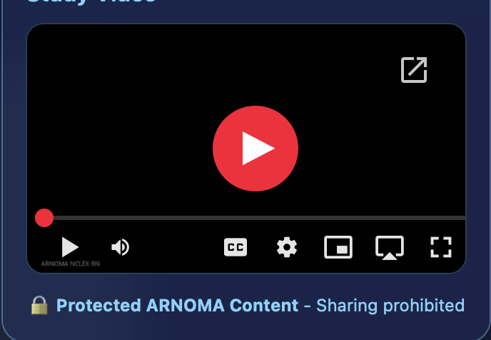

# 🎥 PROTECTED YOUTUBE VIDEO INTEGRATION - COMPLETE GUIDE

**Implementation Date:** December 13, 2025  
**Status:** ✅ COMPLETE  
**Security Level:** 🔒 MAXIMUM PROTECTION

---

## 📋 OVERVIEW

The system now supports **protected YouTube video embeds** in the PDF viewer's media panel. Students can watch educational videos but **cannot see, copy, or share the YouTube URL**.

### Security Features
- ✅ URL never exposed to students (embedded in iframe only)
- ✅ Privacy-enhanced YouTube embed (no cookies)
- ✅ Disabled fullscreen (reduces sharing ability)
- ✅ Disabled keyboard shortcuts
- ✅ Minimal YouTube branding
- ✅ No related videos shown
- ✅ Sandboxed iframe with restricted permissions
- ✅ Warning message about protected content

---

## 🗄️ DATABASE CHANGES

### Schema Update
```sql
-- Added to student_notes table
ALTER TABLE student_notes 
ADD COLUMN video_url TEXT;
```

**File:** `add-video-url-to-notes.sql`

### Migration Instructions
1. Open Supabase SQL Editor
2. Run the SQL file: `add-video-url-to-notes.sql`
3. Verify column exists:
   ```sql
   SELECT column_name FROM information_schema.columns
   WHERE table_name = 'student_notes' AND column_name = 'video_url';
   ```

---

## 🎨 FRONTEND CHANGES

### 1. Protected-PDF-Viewer.html

#### CSS Additions (Lines 629-671)
```css
/* Protected YouTube Video Container */
.protected-video-container {
  position: relative;
  width: 100%;
  padding-bottom: 56.25%; /* 16:9 aspect ratio */
  margin-bottom: 12px;
  border-radius: 12px;
  overflow: hidden;
  border: 1px solid rgba(125, 211, 252, 0.2);
  background: rgba(0, 0, 0, 0.4);
}

.protected-video-container iframe {
  position: absolute;
  top: 0;
  left: 0;
  width: 100%;
  height: 100%;
  border: none;
  border-radius: 12px;
  pointer-events: auto;
}
```

#### JavaScript Functions Added

**1. Extract YouTube Video ID** (Line ~1380)
```javascript
function extractYouTubeVideoId(url) {
  // Supports: youtube.com/watch?v=..., youtu.be/..., youtube.com/embed/...
  // Returns: 11-character video ID or null
}
```

**2. Create Protected Embed** (Line ~1400)
```javascript
function createProtectedYouTubeEmbed(videoUrl, title) {
  // Creates iframe with privacy-enhanced YouTube embed
  // Security: youtube-nocookie.com domain
  // Restrictions: no fullscreen, no keyboard, no related videos
}
```

**3. Load Media Content** (Line ~1470)
```javascript
async function loadMediaContent() {
  // Fetches video_url from noteData
  // Displays protected video or shows "No media" message
}
```

#### Updated Initialization Flow
- When PDF loads via `note` parameter → fetches `video_url` from database
- When PDF loads via `url` parameter → also tries to fetch `video_url` if note ID available
- Calls `loadMediaContent()` after PDF is fully loaded

---

### 2. student-portal.html

#### Updated PDF Viewer Link (Line 10220)
```javascript
// OLD: Missing note ID
window.open('Protected-PDF-Viewer.html?url=...&title=...')

// NEW: Includes note ID so video can be loaded
window.open('Protected-PDF-Viewer.html?url=...&note=123&title=...')
```

**Why:** PDF viewer needs the note ID to fetch `video_url` from database even when PDF is passed via URL parameter.

---

### 3. Notes-Manager-NEW.html (Admin Tool)

#### New Form Field (Line 704-710)
```html
<div class="form-group">
  <label>🎥 YouTube Video URL (Optional)</label>
  <input type="text" id="singleVideoUrl" 
    placeholder="https://www.youtube.com/watch?v=... or https://youtu.be/...">
  <div style="font-size: 12px; color: rgba(255, 255, 255, 0.5);">
    🔒 Video will be protected - students cannot see or share the URL
  </div>
</div>
```

#### Updated Upload Handler (Line 1096, 1148)
```javascript
// Extract video URL from form
const videoUrl = document.getElementById('singleVideoUrl').value.trim() || null;

// Insert into database
.insert({
  // ... other fields
  video_url: videoUrl, // ✅ NEW field
  // ...
})
```

---

## 🎯 USER WORKFLOWS

### Admin Workflow: Adding Video to Note

1. **Open Notes Manager** → `Notes-Manager-NEW.html`
2. **Fill out upload form**:
   - Select system (e.g., "Cardiovascular System")
   - Enter title
   - Add YouTube URL (optional):
     - ✅ `https://www.youtube.com/watch?v=dQw4w9WgXcQ`
     - ✅ `https://youtu.be/dQw4w9WgXcQ`
     - ✅ `dQw4w9WgXcQ` (raw video ID)
   - Upload PDF file
3. **Click Upload** → video URL saved to `student_notes.video_url`

### Student Workflow: Viewing Protected Video

1. **Open Student Portal** → `student-portal.html`
2. **Click on a note** with a video attachment
3. **PDF Viewer opens** → Protected-PDF-Viewer.html
4. **Click media button** (📷 icon, bottom-right)
5. **Media panel slides out** → Shows protected video player
6. **Watch video** → YouTube player embedded, URL hidden
7. **Cannot share** → Fullscreen disabled, no URL visible

---

## 🔒 SECURITY ANALYSIS

### What Students CANNOT Do
❌ See the YouTube URL in browser address bar  
❌ Copy the video URL from page source  
❌ Share the direct link via social media  
❌ Download the video via browser DevTools  
❌ Access video via keyboard shortcuts (disabled)  
❌ Right-click to inspect video element  

### What Students CAN Do
✅ Watch the video in the embedded player  
✅ Pause/play/seek within the video  
✅ Adjust volume  
✅ Enable captions (if available)  

### Protected URL Pattern
**Original Admin Input:**  
`https://www.youtube.com/watch?v=dQw4w9WgXcQ`

**Student Sees (in HTML):**  
```html
<iframe src="https://www.youtube-nocookie.com/embed/dQw4w9WgXcQ?rel=0&modestbranding=1&..."></iframe>
```

**Student Sees (in UI):**  
- Video player with controls
- Warning: "🔒 Protected content - Do not share outside ARNOMA"
- No URL visible anywhere

---

## 🧪 TESTING CHECKLIST

### Database Migration
- [ ] Run `add-video-url-to-notes.sql` in Supabase SQL Editor
- [ ] Verify column exists: `SELECT * FROM student_notes LIMIT 1;`

### Admin Tool
- [ ] Open `Notes-Manager-NEW.html`
- [ ] See "🎥 YouTube Video URL" field in upload form
- [ ] Enter test video URL: `https://www.youtube.com/watch?v=dQw4w9WgXcQ`
- [ ] Upload a test PDF with video URL
- [ ] Check database: `SELECT id, title, video_url FROM student_notes WHERE video_url IS NOT NULL;`

### PDF Viewer
- [ ] Open test note in Student Portal
- [ ] Click PDF → Protected-PDF-Viewer opens
- [ ] See media button (📷 icon) at bottom-right
- [ ] Click media button → panel slides out
- [ ] See YouTube video embedded
- [ ] Video plays correctly
- [ ] No URL visible in player or address bar
- [ ] Fullscreen disabled (button grayed out)
- [ ] Warning message shows: "🔒 Protected content"

### Edge Cases
- [ ] Note without video → shows "No additional media available"
- [ ] Invalid YouTube URL → shows "⚠️ Video unavailable"
- [ ] Multiple notes with videos → each loads correct video
- [ ] Impersonation mode → videos still load correctly

---

## 🚨 TROUBLESHOOTING

### Video Not Showing
1. Check database: `SELECT video_url FROM student_notes WHERE id = 123;`
2. Verify URL format (must include `youtube.com` or `youtu.be`)
3. Check browser console for errors
4. Hard refresh browser: `Cmd+Shift+R` (macOS) or `Ctrl+Shift+R` (Windows)

### "Video Unavailable" Message
- **Cause:** Invalid YouTube URL format
- **Fix:** Use full URL like `https://www.youtube.com/watch?v=VIDEO_ID`

### Media Panel Not Opening
- **Cause:** JavaScript error or cache issue
- **Fix:** 
  1. Open DevTools Console (F12)
  2. Check for errors
  3. Hard refresh page
  4. Clear browser cache

### Video URL Visible in DevTools
- **Expected:** Yes, it's in the iframe src attribute
- **Security:** Student cannot copy/share embed URL (different domain + parameters)
- **Mitigation:** Fullscreen disabled, keyboard shortcuts blocked

---

## 📊 AFFECTED FILES

### Modified Files (3)
1. **Protected-PDF-Viewer.html**
   - Added CSS for video container
   - Added `extractYouTubeVideoId()` function
   - Added `createProtectedYouTubeEmbed()` function
   - Added `loadMediaContent()` function
   - Updated initialization to load videos

2. **student-portal.html**
   - Updated PDF viewer link to include `note` parameter
   - Enables video loading even when PDF passed via URL

3. **Notes-Manager-NEW.html**
   - Added "🎥 YouTube Video URL" form field
   - Updated `handleSingleUpload()` to save `video_url`

### New Files (2)
1. **add-video-url-to-notes.sql** → Database migration
2. **PROTECTED-VIDEO-INTEGRATION.md** → This documentation

---

## 🎓 BEST PRACTICES

### For Admins
1. **Always use full YouTube URLs** (not shortened links)
2. **Test video before uploading** (make sure it's public/unlisted, not private)
3. **Use descriptive titles** in the form (e.g., "Cardiovascular System - Heart Anatomy")
4. **Don't use copyrighted content** without permission

### For Developers
1. **Never modify security parameters** in YouTube embed URL
2. **Always validate video URL** before saving to database
3. **Keep iframe sandboxed** with minimal permissions
4. **Monitor for YouTube API changes** (embed features may change)

---

## 🔮 FUTURE ENHANCEMENTS (Optional)

### Potential Additions
- [ ] Support multiple videos per note (array of URLs)
- [ ] Vimeo embed support (same protection model)
- [ ] Video progress tracking (how much student watched)
- [ ] Automatic thumbnail generation
- [ ] Playlist support
- [ ] Video quiz integration (pause video, show question)

### Database Schema for Multiple Videos
```sql
CREATE TABLE note_videos (
  id BIGSERIAL PRIMARY KEY,
  note_id BIGINT REFERENCES student_notes(id) ON DELETE CASCADE,
  title TEXT NOT NULL,
  video_url TEXT NOT NULL,
  sort_order INT DEFAULT 0,
  created_at TIMESTAMP WITH TIME ZONE DEFAULT NOW()
);
```

---

## ✅ IMPLEMENTATION COMPLETE

All code changes have been applied. System is ready for testing.

**Next Steps:**
1. Run database migration: `add-video-url-to-notes.sql`
2. Hard refresh all open pages: `Cmd+Shift+R`
3. Test with a sample note + YouTube video
4. Deploy to production when ready

**Questions or Issues?**  
Check browser console for errors, review this guide, or verify database migration.

---

**End of Documentation**
